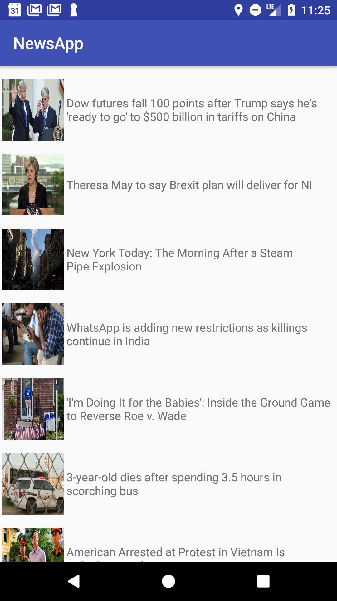

# NewsApp Android App:
A NewsApp Android Client consuming the news api.

## Project Setup

This project is built with Gradle, the [Android Gradle plugin](http://tools.android.com/tech-docs/new-build-system/user-guide). Follow the steps below to setup the project localy.

* Clone [NewsApp](https://github.com/zmwas/NewsApp) inside your working folder.
* Start Android Studio
* Select "Open Project" and select the generated root Project folder
* You may be prompted with "Unlinked gradle project" -> Select "Import gradle project" and select
the option to use the gradle wrapper
* You may also be prompted to change to the appropriate SDK folder for your local machine
* Once the project has compiled -> run the project!

